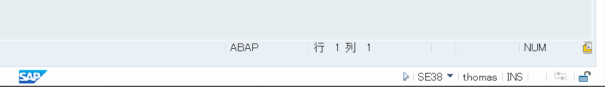
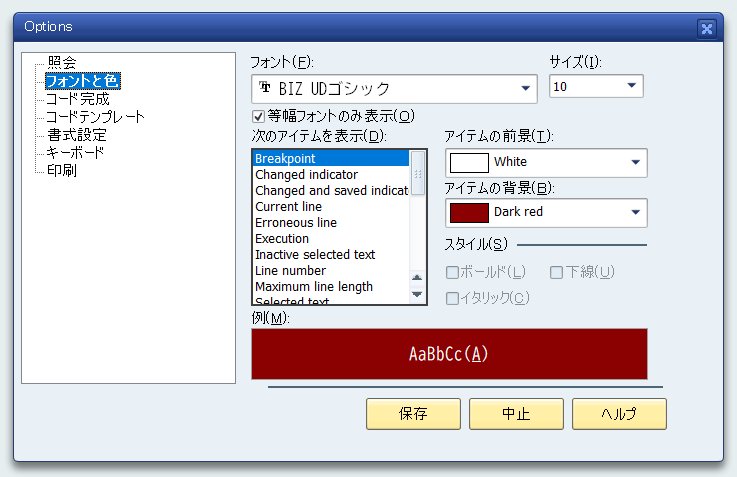
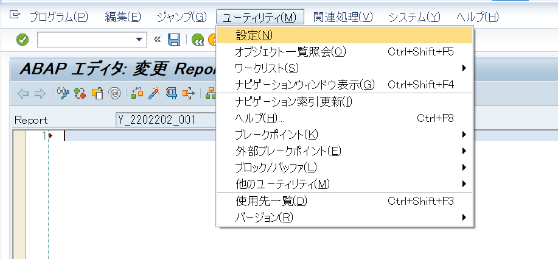
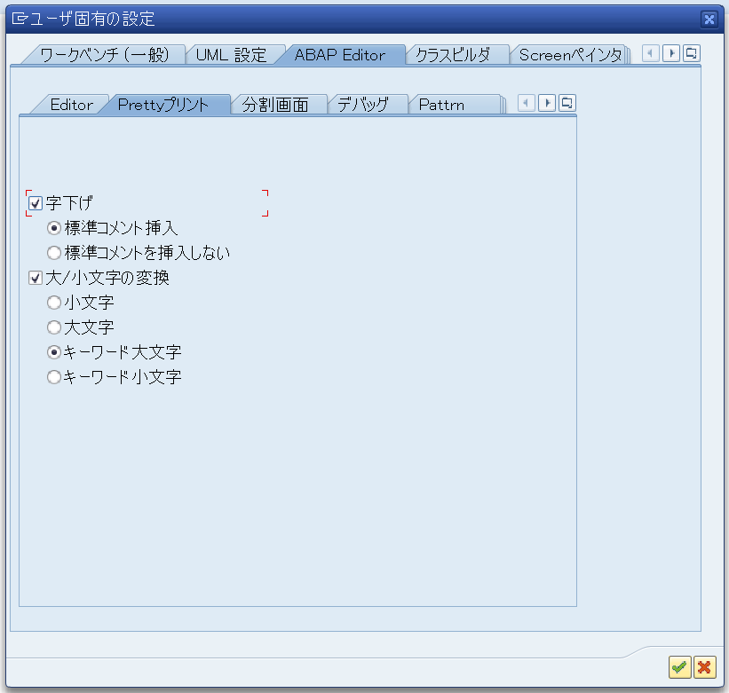

# Introduction <!-- omit in toc -->

## Table of contents <!-- omit in toc -->

- [1. ABAP](#1-abap)
  - [1.1. Hello world](#11-hello-world)
- [2. 環境設定](#2-環境設定)
  - [2.1. エディタ設定](#21-エディタ設定)
  - [2.2. プリティプリント設定](#22-プリティプリント設定)

## 1. ABAP

ABAPは**A**dvanced **B**usiness **A**pplication **P**rogrammingのアクロニムを名称とした言語であり、SAP社のERPパッケージを構築しているプログラミング言語です。標準機能では満たせない要件に対し追加開発（アドオン開発）を行うことを可能とします。COBOLを源流にドメインへ特化させた言語であり、高度なアルゴリズムや数理計算には不向きですが、データベースやSQLとの親和性に重きを置いて作られています。  
オブジェクト指向型・手続型をサポートするマルチパラダイム言語とされている一方で、一般的には手続き型が採用されるため、当ドキュメントでは手続き型を標準として進行します。

### 1.1. Hello world

まずはとりあえず動かしてみましょう。

- コード

  ``` ABAP
  WRITE 'Hello world!!'.
  ```

- 実行結果

  ``` text
  Hello world!!
  ```

## 2. 環境設定

### 2.1. エディタ設定

ソースコードの編集を行うABAP エディタ画面の各種設定が可能です。

1. ABAPエディタ設定画面  
画面右下のオレンジ色のアイコンをクリックして開きます  

2. オプション画面  

   - **照会**の**行番号**にチェックを入れ、行番号を表示します。
   - フォントは**フォントと色**の**フォント**で`MSゴシック`を選択します。

### 2.2. プリティプリント設定

ABAPエディタ画面のユーティリティから設定画面を開き、`Prettyプリント`を設定します。  

