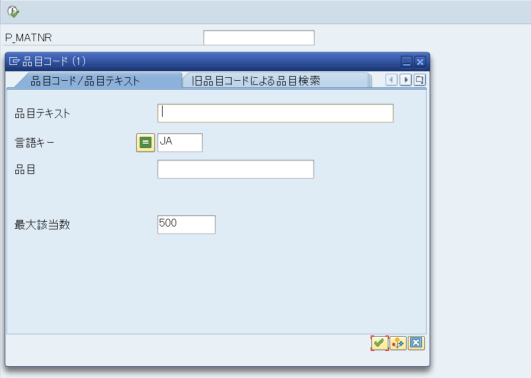
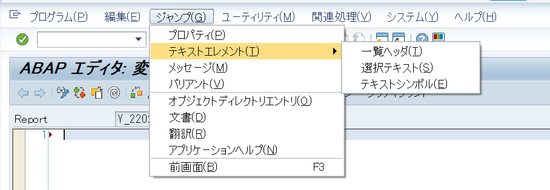
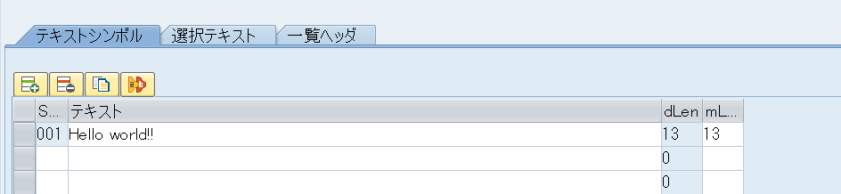

# Basic <!-- omit in toc -->

## Table of contents <!-- omit in toc -->

- [1. 一般構文](#1-一般構文)
- [2. データ型とデータオブジェクト（変数）](#2-データ型とデータオブジェクト変数)
  - [2.1. 事前定義データ型](#21-事前定義データ型)
  - [2.2. ドメイン](#22-ドメイン)
  - [2.3. 変数の定義](#23-変数の定義)
- [3. 宣言](#3-宣言)
  - [3.1. TYPES 型宣言](#31-types-型宣言)
  - [3.2. DATA 変数宣言](#32-data-変数宣言)
  - [3.3. CONSTANTS 定数宣言](#33-constants-定数宣言)
  - [3.4. RANGE レンジ型変数の宣言](#34-range-レンジ型変数の宣言)
- [4. 命令文 その１（画面出力とデータ操作）](#4-命令文-その１画面出力とデータ操作)
  - [4.1. 選択画面](#41-選択画面)
  - [4.2. データ操作](#42-データ操作)
  - [4.3. 画面出力](#43-画面出力)
- [5. テキストエレメント](#5-テキストエレメント)
- [6. 演習２ テキストシンボルと選択テキスト](#6-演習２-テキストシンボルと選択テキスト)
- [7. 命令文 制御構文](#7-命令文-制御構文)
  - [7.1. 条件分岐](#71-条件分岐)
  - [7.2. 繰り返し](#72-繰り返し)
- [8. 演習３ 選択画面操作と分岐](#8-演習３-選択画面操作と分岐)
- [9. OPEN SQL](#9-open-sql)
- [10. システム項目](#10-システム項目)
- [11. 演習４ 単表から１件のデータ取得と表示](#11-演習４-単表から１件のデータ取得と表示)
- [12. 内部テーブルの操作](#12-内部テーブルの操作)
  - [12.1. データを読み出す](#121-データを読み出す)
  - [12.2. データを追加する](#122-データを追加する)
  - [12.3. データを削除する](#123-データを削除する)
  - [12.4. データを更新する](#124-データを更新する)
  - [12.5. データをソートする](#125-データをソートする)
- [13. サブルーチン](#13-サブルーチン)

## 1. 一般構文

まずはABAPでプログラミングする中で汎用的に必要な要素を覚えましょう。

- コメント  
  `*`から始まる行はコメントになります。
  また、行中の`"`以降はコメントになります。

- テキストリテラル  
  テキストリテラルは`'`で囲みます。

- 命令の終了  
  各命令文は`.`で終了します。

- チェーン命令  
  `:`を使用すると同一命令文を一つにまとめることができます。
  コロンの後に続く各命令は`,`で区切ります。

<details><summary>参考</summary>

***

``` ABAP   画面出力の例
* 地道な記述
WRITE 'Hello'.
WRITE 'World!!'.

* チェーン命令による記述
WRITE:
    'Hello',          " <-ピリオドではなくカンマで区切ります
    'World!!'.
```

***
</details>

## 2. データ型とデータオブジェクト（変数）

ABAPには通常のプログラム言語と同様に「型」と「変数」が存在します。型は標準で用意されているものと、開発者が独自に定義できるものがあります。

### 2.1. 事前定義データ型

ABAPプログラム内で使用可能な**基本ABAPデータ型**です。Javaで云えばプリミティブ型に該当します。

- 固定長
  - 数値
    - `I`: 整数
    - `F`: 浮動小数点数
    - `P`: パック数値
  - 文字
    - `C`: テキスト項目
    - `D`: 日付項目
    - `N`: 数値テキスト項目
    - `T`: 時間項目
  - 16進数
    - `X`: 16進項目
- 可変長
  - 文字列
    - `STRING`: 可変長文字列
  - バイト文字列
    - `XSTRING`: 可変長16進列

<!-- パック型の説明をどこかに設けたい -->

### 2.2. ドメイン

ABAPでは特定のデータ型を事前登録することが出来ます。たとえば商品データテーブルMARAの「品目コード」項目であるMATNRは`MATNR`というドメインを参照しています。この`MATNR`は18桁のCHAR型としてSAPのデータベースに事前登録されています。  
Javaで例えれば、ラッパークラス`Integer`がプリミティブ型`int`の拡張版であるように、ドメイン`MATNR`はディクショナリデータ型`CHAR`に長さや変換ルーチンの情報を付加して拡張したものです。

> 詳しくは「ABAPディクショナリ」の研修で扱います。

### 2.3. 変数の定義

変数は型を参照してプログラム中で定義されます。変数には基本データ、構造、内部テーブルがあります。

- 基本データ  
  単一のデータを格納する変数です。

  ``` ABAP
  DATA 基本データ名 TYPE 型.
  ```

- 構造  
  複数の項目をひとまとめにして扱う変数です。ただしJavaにおける配列とは異なり、CやRustにおける__構造体__と近いものです。

  ``` ABAP
  DATA 構造名 TYPE 構造型名.
  ```

  <details><summary>参考</summary>

  ***

  商品データテーブル`mara`には

  - `matnr`: 品目コード
  - `ersda`: 登録日
  - `mtart`: 品目タイプ
  - `meins`: 基本数量単位

  などが定義されています。  
  この`mara`を参照して定義された構造型変数は、メンバ（要素）としてこれらの項目を持ちます。

  > maraを参照した構造の**st_material**
  > | matnr | ersda | mtart | meins | ... |
  > |------|-------|-------|-------|-----|

  各メンバへのアクセスは「-」（ハイフン）を使用します。

  ``` ABAP
  st_material-matnr = 'ITEM001'.
  st_material-ersda = '20040101'.
  ```

  ***
  </details>

- 内部テーブル  
  二重配列に近いイメージです。構造変数を配列にした形であり、複数の項目と複数の行を持ちます。メモリ上でデータベーステーブルのように扱うことができます。

  <details><summary>参考</summary>

  ***

  商品データテーブルと同じ構造を持つ内部テーブルを宣言します

  ``` ABAP
  DATA:
      it_material TYPE STANDARD TABLE OF mara.
  ```

  これにより以下のような内部テーブルが作成されます。

  | matnr   | ersda    | mtart | meins | ... |
  | ------- | -------- | ----- | ----- | --- |
  | ITEM001 | 20040101 | HALB  | PC    | ... |
  | ITEM002 | 20040401 | ROH   | G     | ... |
  | ITEM003 | 20040501 | HAWA  | PC    | ... |
  | ITEM004 | 20040601 | HALB  | PC    | ... |

  ***

  </details>

  内部テーブルは用途に応じて３種類のタイプを使い分けることが可能です。

  - 標準テーブル  
    `STANDARD TABLE`として宣言します。通常は標準テーブルを使用します。アクセスにはインデックスもしくはキーを使用します。

  - ソートテーブル  
    `SORTED TABLE`として宣言します。指定されたキーに対してソートされていることを保証する内部テーブルです。アクセスにはインデックスもしくはキーを使用します。

  - ハッシュテーブル  
    `HASHED TABLE`として宣言します。アクセスには内部的にハッシュキーを用います。一意検索に対してパフォーマンスを発揮します。

## 3. 宣言

### 3.1. TYPES 型宣言

型は`TYPES`によって宣言します。

- 基本データ型  

  ``` ABAP
  * 構文
  TYPES (データ型名) TYPE (データ型).

  * 例
  TYPES t_matnr TYPE mara-matnr.  "商品データの品目コードと同じ型を宣言
  ```

- 構造データ型  

  ``` ABAP
  * 構文
  TYPES :
      BEGIN OF (構造データ型名),
        (データ型名) TYPE (データ型),
        (データ型名) TYPE (データ型),
      END   OF (構造データ型名).

  * 例
  TYPES :
      BEGIN OF tst_materials ,
        matnr TYPE mara-matnr,  " 商品データテーブルの品目コード
        werks TYPE marc-werks,  " 品目プラントテーブルのプラント
        maktx TYPE makt-maktx,  " 品目名称テーブルの品名
      END OF tst_materials.
  ```

- テーブルデータ型  

  ``` ABAP
  * 構文
  TYPES (テーブルデータ型名) TYPE STANDARD TABLE OF (構造データ型名).

  * 例
  TYPES tit_materials TYPE STANDARD TABLE OF tst_materials.
  ```

### 3.2. DATA 変数宣言

変数は`DATA`によって宣言します。

``` ABAP
* 構文
DATA (変数名) TYPE (データ型).

* 例
DATA:
  v_text            TYPE string,                  " 事前定義データ型で定義
  v_material_name   TYPE material_name,           " すでに宣言されている変数を参照する場合
  st_material       TYPE mara,                    " テーブルをTYPEで参照すると構造型になる
  it_material       TYPE STANDARD TABLE OF mara,  " 商品データテーブルを参照した内部テーブルの宣言
  st_materials      TYPE tst_materials,           " ローカルで定義した構造型を参照する場合
  it_materlals      TYPE tit_materials.           " ローカルで定義した内部テーブル型を参照する場合
```

### 3.3. CONSTANTS 定数宣言

プログラムで使用される固定の値に別名をつけるイメージです。定数は`CONSTANTS`で宣言します。

``` ABAP
* 構文
CONSTANTS (定数名) TYPE (データ型) VALUE (初期値).

* 例
CONSTANTS cns_tax_rate TYPE f VALUE '0.1'. 消費税率を意味する定数宣言
```

定数を利用するメリット

1. 可読性の向上  
ソースコード内で"0.1"と書かれているよりも、cns_tax_rateと書かれている方が消費税率の値であることが把握できます。
2. 保守性の向上  
たとえば消費税率が10%から15%に変わった場合に、消費税の計算する箇所で"0.1"と書いていると、ソースコードを一通り目を通して一つずつ"0.15"に置き換える必要があり大変です。このときに定数を利用していると、消費税率の定数の値を変更するだけで済みます。  
なお後述しますが、リテラルについてはメリットの有無に関わらず、開発規約によって定数化することを指定されることが多いです。

### 3.4. RANGE レンジ型変数の宣言

レンジ型変数は`RANGE OF`を用いて宣言します。

``` ABAP
* 構文
DATA (レンジテーブル名) TYPE RANGE OF (データ型).

* 例
DATA r_ersda TYPE RANGE OF mara-ersda. 商品データテーブルの登録日付
```

レンジ型変数とは、値の”範囲”を持たせることができる内部テーブルのことです。レンジ型変数を宣言すると以下の4項目を持つ変数が作成されます。

- SIGN  
  `LOW`と`HIGH`の値を含めるか、除外するかの設定をします。

  - I：含める(INCLUDE)
  - E：除外する(EXCLUDE)
- OPTION  
  範囲の指定方法を設定します。以下はその一部です。

  - BT：`LOW`から`HIGH`の値を指定
  - EQ：`LOW`の値のみを指定
- LOW  
  下限値を指定します。
- HIGH  
  上限値を指定します。OPTIONが`BT`、`NB`のときのみ使用されます。

  <details><summary>参考</summary>

  ***

  | SIGN | OPTION | LOW | HIGH |
  | ---- | ------ | --- | ---- |
  | I    | BT     | 1   | 10   |
  | I    | EQ     | 15  |      |
  | E    | BT     | 2   | 5    |

  - １行目：1以上10以下
  - ２行目：15
  - ３行目：2より大きく5未満

  ***

  </details>

> - 特にコーディング規約などで指定が無い場合は、チーム内で統一された分かりやすい接頭辞(prefix)をつけることをお勧めします。
> - 構造型には使用する項目のみを含めるようにすると無駄なメモリの使用が避けられ、パフォーマンスが向上します。可能な限りローカルで型を定義し、それを参照してください。
> - プログラム内ではなるべくリテラルを直接使わずに、定数を宣言して使用してください。

## 4. 命令文 その１（画面出力とデータ操作）

- REPORT  
  プログラムの最初に記述し、実行可能プログラムとして定義します。謂わばフレームワークのような物であり、後述の選択画面、出力画面が提供されます。また、画面サイズ等のオプションを追加することも可能です。

  ``` ABAP
  * 構文
  REPORT  プログラム名.

  * 例 画面サイズ170*58、プログラム表題を非出力として実行可能プログラムを定義
  REPORT  Y_SAMPLE001
      NO STANDARD PAGE HEADING
      LINE-SIZE   170
      LINE-COUNT  58.
  ```

### 4.1. 選択画面

- PARAMETERS  
  選択画面の入力項目を作成します。必須入力や初期値などのオプションを追加することも可能です。

  ``` ABAP
  * 構文
  PARAMETERS 項目名 TYPE データ型.

  * 例 maraテーブルのmatnrを参照した型で入力項目を作成
  PARAMETERS:
      p_matnr TYPE mara-matnr.
  ```

  

  

  また、ラジオボタンの作成もPARAMETERSで行います。

  ``` ABAP
  * 構文
  PARAMETERS ボタン名 RADIOBUTTON GROUP ボタングループ.

  * 例 選択するとXが入るボタン
  PARAMETERS:
    bt1 RADIOBUTTON GROUP rad1 DEFAULT 'X',
    bt2 RADIOBUTTON GROUP rad1.
  ```

  

- SELECT-OPTIONS  
  選択画面の範囲選択項目を定義します。入力する項目を表す変数を事前に定義する必要があります。

  ``` ABAP
  * 構文
  SELECT-OPTIONS 項目名 FOR 変数.

  * 例 maraテーブルのmatnrを参照した型で、範囲選択を作成します。
  DATA:
    v_matnr TYPE mara-matnr.

  SELECT-OPTIONS:
    s_matnr FOR  v_matnr.
  ```

### 4.2. データ操作

- COMPUTE  
  算術演算を行います。ただしこの命令語は省略可能なので、実際に記述することはあまりありません。

  ``` ABAP
  * 構文
  COMPUTE 算術演算式.

  * 例 b + c を aへ代入します。
  COMPUTE a = b + c.
  ```

- MOVE  
  値をコピーします。この命令語は代入演算子で代用することができます。

  ``` ABAP
  * 構文
  MOVE コピー元 TO コピー先.

  * 例
  ```

- MOVE-CORRESPONDING  
  構造型変数の値をコピーします。このとき、各要素に対応する値が転送されます。なお「安全のために絶対書け」派と「処理を軽量化するために絶対書くな」派に分かれるようです。開発規約に従ってください。

  ``` ABAP
  * 構文
  MOVE-CORRESPONDING コピー元の構造 TO コピー先の構造.

  * 例
  ```

- CLEAR  
  変数や構造型変数を初期化します。

  ``` ABAP
  * 構文
  CLEAR 変数.

  * 例
  ```

- CONCATENATE  
  文字列を結合します。

  ``` ABAP
  * 構文 文字列a,bを結合して、cへ代入します。
  CONCATENATE 文字列１ 文字列２ INTO 代入先.

  * 例
  CONCATENATE 'HELLO' 'WORLD' INTO NEWMESSAGE.
  ```

### 4.3. 画面出力

- WRITE  
  画面への出力を行います。

  ``` ABAP
  * 構文
  WRITE 出力するもの.

  * 例
  WRITE 'ABCDEFG'. 文字列を出力します。
  WRITE / . 改行します。
  WRITE 10 'ABCDEFG'. 出力位置を指定します。
  WRITE sy-vline. 縦罫線を出力します。
  WRITE sy-uline. 横罫線を出力します。
  ※ 詳しい構文はABAP HELPを参照してください。
  ABAPの構文に関するHELPはソースコード上の構文にカーソルを当て「F1」キーで確認できます。

## 6. 演習１ 選択画面操作と結果表示

- 問題  
  1. 選択画面でInt型の必須パラメータを２つ作り、それらのパラメータを足した数字を表示する
      - [ ] 2つのパラメータの初期値をそれぞれ、`4`、`5`とする
      - [ ] 2つのパラメータは必須入力とする
  2. 選択画面でCHAR型の必須パラメータを２つ作り、2つの文字列`FirstName`、`FamilyiName`を記入し、その2つの文字列をつなげて表
      - [ ] 2つの文字の間には、半角スペースを入れる
- ヒント  
  - 選択画面の設定は、`PARAMETERS`を使用する。
  - 結果の表示は、`WRITE`を使用する。
  - 文字をつなげるには、`CONCATENATE`を使用する。

- 結果  
  1. 選択画面
     結果画面
  2. 選択画面
     結果画面

<details><summary>解説</summary>

***

1. コード例

  ``` abap
  *&---------------------------------------------------------------------*
  *&     変数定義
  *&---------------------------------------------------------------------*
  DATA:
    lv_sum  TYPE i.

  *&---------------------------------------------------------------------*
  *&      選択画面定義
  *&---------------------------------------------------------------------*
  PARAMETERS:
    p_num1  TYPE i DEFAULT 4 OBLIGATORY,
    p_num2  TYPE i DEFAULT 5 OBLIGATORY.

  *&=====================================================================*
  *&      メイン処理
  *&=====================================================================*
  COMPUTE
    lv_sum = p_num1 + p_num2.

  WRITE:
    lv_sum.
  ```

2. コード例

``` abap
*&---------------------------------------------------------------------*
*&     変数定義
*&---------------------------------------------------------------------*
DATA:
  lv_fullname   TYPE c LENGTH 40.

*&---------------------------------------------------------------------*
*&      選択画面定義
*&---------------------------------------------------------------------*
PARAMETERS:
  p_firstname   TYPE c LENGTH 20,
  p_familyname  TYPE c LENGTH 20.

*&=====================================================================*
*&      メイン処理
*&=====================================================================*
CONCATENATE
  p_firstname
  p_familyname
  INTO lv_fullname
  IN CHARACTER MODE SEPARATED BY ' '.

WRITE:
  '氏名：',
  lv_fullname.
```

</details>

## 5. テキストエレメント

プログラム内で使用するテキスト（メッセージ、表題）を一元管理することができます。また、ログオン言語に応じて言語を変えることも可能です。



- 選択テキスト  
  選択画面上に表示される項目の表示名を設定します。

  
  
  
- テキストシンボル  
  プログラム内で使用する文字列を設定します。プログラム中では`text-xxx`として使用します。

  

  ``` ABAP
  WRITE : text-001.
  ```

  

## 6. 演習２ テキストシンボルと選択テキスト

- 問題  
  1. 演習１で作成したプログラムの選択画面に以下の変更を加えてください。
      - [ ] 項目名の表示をそれぞれ、`みょうじ`、`おなまえ`と表示する。
      - [ ] 結果データ表示の初めに`氏名：`と表示する。

- 結果  
  1. 選択画面
  
  2. 結果画面
  

## 7. 命令文 制御構文

### 7.1. 条件分岐

- IF  
  式の評価に応じて分岐を行います。

  ``` ABAP
  IF 条件式1.
    処理1
  ELSEIF 条件式2.
    処理2
  ELSE .
    処理3
  ENDIF.
  ```

  > 「IF文には必ずELSEを実装しろ」派と「空実装は絶対にするな」派が居ます。開発規約に従ってください。

- CASE  
  値に応じて分岐を行います。

  ``` ABAP
  CASE 変数.
    WHEN 値1.
      処理1.
    WHEN 値2.
      処理2.
    WHEN OTHERS.
      処理3.
  ENDCASE.
  ```

  Javaでは値１、値２には定数のみ指定可能ですが、ABAPにおいては変数を指定しても構文上の問題はありません。

  > 「CASE文には必ずOTHERを実装しろ」派と「空実装は絶対にするな」派が居ます。開発規約に従ってください。


### 7.2. 繰り返し

- LOOP  
  内部テーブルから構造へデータを一行ずつ取り出します。

  ```abap
  * 構文
  LOOP AT 内部テーブル INTO 構造.
    処理
  ENDLOOP.
  ```

  また、特定の条件に合致する行のみをループさせることも可能です。

  ```abap
  * 構文
  LOOP AT 内部テーブル INTO 構造 WHERE 条件式.
    処理
  ENDLOOP.
  ```

- WHILE  
  条件式が真である間、処理を繰り返します。

  ```abap
  * 構文
  WHILE 条件式.
    処理
  ENDWHILE.
  ```

- DO  
  指定した回数処理を繰り返します。回数を指定しなければ無限ループします。

  ```abap
  * 構文
  DO 回数 TIMES.
    処理
  ENDDO.
  ```

繰り返しの制御には以下の制御文を使うことが出来ます。

- CONTINUE  
  現在の処理を終了して次のループへ移行します。
- EXIT  
  ループ処理全体を終了します。
- CHECK  
  条件式が真であるとき、CONTINUEを行います。

> 無限ループには十分注意してください。
> ここに挙げた構文は一例です。使用の際はABAP HELPを参照してください。

## 8. 演習３ 選択画面操作と分岐

- 問題  
  演習１の選択画面にラジオボタンを4つ付け足し、ラジオボタンの選択により和、差、積、商の計算結果を表示するようにプログラムを変更してください。
  なお商の場合のみ、小数点３桁まで表示します。

- ヒント  
  -ラジオボタンは、PARAMETERSのオプションRADIOBUTTERNを使用する
  - 小数点３桁はパック型で宣言し、DECIMALオプションを使用する
- 結果  

## 9. OPEN SQL

ABAPからデータベースへ発行されるクエリをOPEN SQLといいます。OPEN SQLはシステムによってデータベース固有のSQLへと変換されるので、データベース製品を意識せずにクエリを発行することができます。そのため、ABAPへ直接ネイティブSQLを記述することができますが、通常は行いません。
> 詳細は HELP ネイティブSQL を参照

``` ABAP
* 基本構文 概ね標準SQLに沿ったものとなっています。
SELECT
    項目１
    項目２
INTO
    変数名
FROM
    テーブル名
WHERE
    条件式
GROUP BY
    グループ項目
HAVING
    集計項目への条件式
ORDER BY
    ソート項目.

* 例
TYPES:
    BEGIN OF tst_materials ,            " 取得する項目を纏めた構造型
      matnr TYPE mara-matnr,              " 品目コード
      werks TYPE marc-werks,              " プラント
      maktx TYPE makt-maktx,              " 品目テキスト
    END OF tst_materials.

DATA:
    st_materials TYPE tst_materials.    " 上記で定義した構造型の構造変数

SELECT
    mara~matnr                          " 取得する項目
    marc~werks                          " 取得元のテーブルが複数ある場合は
    makt~maktx                          " 「データベース名~項目名」で記述
INTO CORRESPONDING FIELDS OF
    st_materials                        " 取得した値を受け取る変数
FROM
    mara  JOIN  marc                    " 取得元テーブル
        ON mara~matnr = marc~matnr      " テーブルの結合条件
        LEFT OUTER JOIN makt            " 左外部結合
        ON mara~matnr = makt~matnr
            AND makt~spras = sy-langu   " sy-languはログオン言語
WHERE
    marc~werks = '1000'                 " プラント1000のデータのみ
.
```

- SELECT SINGLE
  1件のみ取得したい場合に使用します。

  ``` ABAP
  * 構文
  SELECT SINGLE
      項目
  INTO
      変数
  FROM
      テーブル
  WHERE
      条件.
  ```

  > WHERE句によって一意に絞り込まれない場合、どのデータが取得されるかは保証されません。

- SELECT INTO TABLE
  複数行のデータを取得して、内部テーブルへ代入する際に使用します。一旦内部テーブルにデータを格納すると、メモリ上で高速にデータ処理を行うことが可能になります。

  ``` ABAP
  * 構文
  SELECT
      項目
  INTO CORRESPONDING FIELDS OF TABLE
      内部テーブル
  FROM
      テーブル
  WHERE
      条件
  .
  ```

- FOR ALL ENTRIES
  データベーステーブルと内部テーブルによる集合演算を行います

  ``` ABAP
  * 構文
  SELECT
      項目１
      項目２
  INTO CORRESPONDING FIELDS OF TABLE
      内部テーブル１
  FROM
      テーブル１
  FOR ALL ENTRIES IN
      内部テーブル２
  WHERE
      項目１ = 内部テーブル２-項目１
  .
  ```

  > 内部テーブル２のデータが０件の場合、データは全件取得となり集合演算が狂います。
  > 内部テーブル２にデータが無い場合はSELECTを行わないようなコーディングが必要となります。
  > また、FOR ALL ENTRIES使用時、そのSELECT文は自動的にDISTINCTされます。

> SQLのパフォーマンスに関する一般的なセオリーは基本的に通用します。索引を効率よく使用するSQLを心がけてください。
> 操作手順は、「11_ABAP開発クイックスタートガイド_操作.xlsx」を参照ください。

## 10. システム項目

SAPには読み取り専用として自動的に作成される変数があります。以下はその一例です。  

プログラム内でよく使用するもの

- SY-SUBRC  
  リターンコードと呼称されます。直前の処理の終了ステータスを示し、正常終了時には`0`が入るため、これを用いてエラーのハンドリングを行うことが出来ます。各処理毎に設定されるコードは異なるため、詳細はHELPを参照してください。  
  使用例

  ```abap
  * 検索したい値が内部テーブルに存在するか調べる
  READ TABLE 内部テーブル TRANSPORTING NO FIELDS
      WITH KEY 条件式.

  IF sy-subrc = 0.
    " READが正常終了した：データが存在した
  ELSE.
    " READが異常終了した：データが存在しなかった
  ENDIF.
  ```

- SY-INDEX  
  繰り返し処理の現在のループパス件数が入ります。
- SY-TABIX  
  内部テーブルの現在の行索引が入ります。
- SY-LANGU  
  ログオン言語が入ります。
- SY-UNAME  
  ログオンユーザー名が入ります。
- SY-MANDT  
  ログオンクライアント番号が入ります。
- SY-DATUM  
  現在日時が入ります。
- SY-UZEIT  
  現在時刻が入ります。

画面出力でよく使用するもの

- SY-ULINE  
  水平線
- SY-VLINE  
  垂直線  

  使用例

  ```abap
  * WRITE命令によって画面へ出力します。
  WRITE:
      SY-ULINE,
      SY-VLINE.
  ```

## 11. 演習４ 単表から１件のデータ取得と表示

- 問題
  CSKSより、１件の原価センタデータを取得して表示してください。
  - 選択パラメータ（全て必須項目とする）
    - `KOKRS` ：管理領域
    - `KOSTL` ：原価センタ
    - `DATE`  ：有効日
  - 表示項目
    - `KOKRS` ：管理領域
    - `KOSTL` ：原価センタ
    - `DATAB` ：有効開始日
    - `DATBI` ：有効終了日
    - `BUKRS` ：会社コード
    - `GSBER` ：事業領域
    - `PRCTR` ：利益センタ

    有効日は、その日に有効な原価センタを取得するために使用
    よって、SELECT文の有効日の条件は 有効開始日≦有効日≦有効終了日 とする
- ヒント
  - SELECT SINGLEで取得する
  - １行取得、１行表示のため、構造の宣言のみ（内部テーブル宣言は不要）
  - 表示はWRITEで行う
- 結果
  ＜選択画面＞
  ＜結果表示＞
- テストのポイント
  - [ ] 必須を入力しない場合、エラーとなり、メッセージが表示されるか？
  - [ ] 日付でない数値（2014/12/99など）を入力した場合、エラーとなりメッセージが表示されるか？
  - [ ] 指定された表示項目が表示されているか？
  - [ ] 指定した条件に見合ったデータが出力されているか？
  > 特に有効日（P_DATE）については、条件の閾値前後のデータが仕様通りに選択されるかを確認

## 12. 内部テーブルの操作

### 12.1. データを読み出す

他言語の二重配列のように、一次インデックス、二次インデックスを指定して読み出しと云った操作はできません。

- READ
  条件式に従って、内部テーブルから構造へデータを読み出します。指定の検索条件に該当する行が一意で無い場合は、最初に見つかったデータがコピーされます。

  ``` ABAP
  * 構文
  READ TABLE 内部テーブル
      INTO 構造
      WITH KEY 条件式.
  ```

  また、検索には二分探索を適用することで高速化することが出来ます。二分探索を使用する際には、検索条件の列がソートされている必要があることに注意しましょう。

  ``` ABAP
  * 構文
  READ TABLE 内部テーブル
      INTO 構造
      WITH KEY 条件式
      BINARY SEARCH.
  ```

  > 内部テーブルのデータを１行ずつ繰り返し読み出しながら処理するにはLOOP文を使用します。
  > 制御構文の章を参照してください。

### 12.2. データを追加する

- APPEND
  構造や内部テーブルの値を内部テーブルの末尾へ追加します。内部テーブルと構造の項目は同じである必要があります。

  ``` ABAP
  * 構文 構造の追加
  APPEND 構造 TO 追加先内部テーブル.

  * 内部テーブルの追加
  APPEND LINES OF 内部テーブル TO 追加先内部テーブル.
  ```

- INSERT
  条件式に従って、内部テーブルへデータを追加します

  ``` ABAP
  * 構文
  INSERT 構造 INTO 追加先内部テーブル 条件式.
  ```

### 12.3. データを削除する

- DELETE
  条件式にしがって行を削除します。

  ``` ABAP
  * 構文
  DELETE 内部テーブル 条件式.
  ```

- CLEAR
  内部テーブルを初期化します。

  ``` ABAP
  * 構文
  CLEAR 内部テーブル.
  ```

- FREE
  内部テーブルを破棄します。メモリの予約領域も同時に解放されます。

  ``` ABAP
  * 構文
  FREE 内部テーブル.
  ```

### 12.4. データを更新する

- MODIFY
  内部テーブルの行を、構造によって更新します。オプションや構文で動作が大きく変わるので、詳細はABAP HELPを参照してください。

  ``` ABAP
  * 構文（行番号を指定して更新する場合）
  MODIFY 内部テーブル FROM 構造 INDEX 行番号.
  ```

### 12.5. データをソートする

- SORT
  指定した列の値に沿って内部テーブルをソートします。昇順、降順のほか、二次以降のソートを指定することも可能です。

  ``` ABAP
  * 構文
  SORT 内部テーブル BY 列名 ソート方向.
  ```

## 13. サブルーチン

プログラムの中で一連の処理を纏めて定義し、呼び出して使うことが出来ます。引数には以下の二種があります。

- USING変数
  サブルーチンの中で変更することができない引数です。
- CHANGING変数
  サブルーチンの中で変更することができる引数です。関数における戻り値とは異なり、外部から与える必要があります。

サブルーチンの定義方法

  ``` ABAP
  * 構文
  FORM サブルーチン名
      USING
        変数 TYPE 変数の型
      CHANGING
        変数 TYPE 変数の型.

    定義したい処理
  ENDFORM.

  * 例 二つの変数の和を返すサブルーチン
  FORM do_sum
      USING
        u_num1 TYPE i
        u_num2 TYPE i
      CHANGING
        c_num TYPE i.

     c_sum = u_num1 + u_num2.
  END FORM.
  ```

引数の型を定義する際には`TYPE STANDARD TABLE OF`は使えません。事前に内部テーブル型を用意し、それを指定するようにしてください。

サブルーチンの呼び出し方法

``` ABAP
* 構文
PERFORM サブルーチン名
    USING
      変数
    CHANGING
      変数.

* 例 前述で作成したサブルーチンを呼び出す
PERFORM do_sum
    USING
      g_num1
      g_num2
    CHANGING
      g_num3.
```

サブルーチンの制御文

- RETURN
  サブルーチンの処理を中断することが出来ます。

  ``` ABAP
   * 例
  FORM HOGEROUTINE.

    IF サブルーチンの終了条件.
      RETURN.         " <- サブルーチンを抜けて元の処理に戻る
    ENDIF.

  ENDFORM.
  ```
