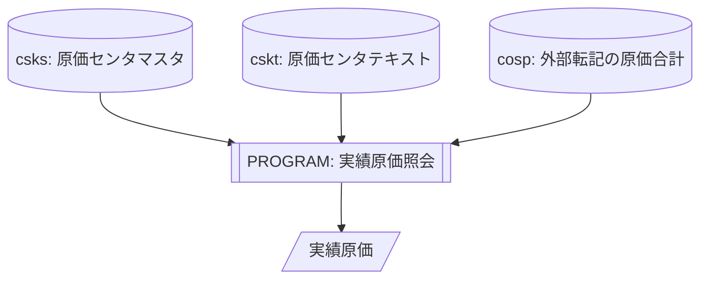
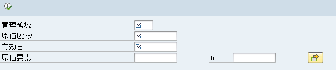
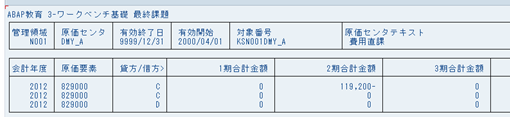

# 課題 <!-- omit in toc -->

## 目次 <!-- omit in toc -->

- [1. 全体機能要約](#1-全体機能要約)
- [2. 関連図](#2-関連図)
- [3. 選択画面](#3-選択画面)
- [4. データ取得](#4-データ取得)
  - [4.1. 原価センタデータ読み込み](#41-原価センタデータ読み込み)
  - [4.2. 実績金額読み込み](#42-実績金額読み込み)
- [5. 画面出力](#5-画面出力)

## 1. 全体機能要約

原価センタのマスタと実績/計画バージョンの原価要素の期間ごとの合計金額を表示する。

## 2. 関連図



## 3. 選択画面

- 選択項目  
  | 順番 | 項目名     | DB名 | 項目名 | データ型 | 桁数 | 必須           | 備考       |
  | ---- | ---------- | ---- | ------ | -------- | ---- | -------------- | ---------- |
  | 1    | 管理領域   | CSKS | KOKRS  | CHAR     | 4    | ○              | PARAMETERS |
  | 2    | 原価センタ | CSKS | KOSTL  | CHAR     | 10   | ○              | PARAMETERS |
  | 3    | 有効日     | CSKS | DATAB  | DATS     | 8    | ○              | PARAMETERS |
  | 4    | 原価要素   | COSP | KSTAR  | CHAR     | 10   | SELECT-OPTIONS |            |
- レイアウト  
  
- バリデーションチェック  
  選択画面において、入力された管理領域の存在チェックを掛ける。

## 4. データ取得

### 4.1. 原価センタデータ読み込み

- 対象テーブル  

  ```mermaid
  flowchart TD
  csks[(csks: 原価センタマスタ)]
  cskt[(cskt: 原価センタテキスト)]
  ```

- 取得項目  
  | 名称               | DB名 | 項目名 |
  | ------------------ | ---- | ------ |
  | 管理領域           | CSKS | KOKRS  |
  | 原価センタ         | CSKS | KOSTL  |
  | 有効終了日         | CSKS | DATBI  |
  | 有効開始日         | CSKS | DATAB  |
  | 対象番号           | CSKS | OBJNR  |
  | 原価センタテキスト | CSKT | LTEXT  |
- 結合条件  
  | 結合項目   | 条件 | 結合項目   |
  | ---------- | ---- | ---------- |
  | CSKT-SPRAS | =    | SY-LANGU   |
  | CSKS-KOKRS | =    | CSKT-KOKRS |
  | CSKS-KOSTL | =    | CSKT-KOSTL |
  | CSKS-DATBI | =    | CSKT-DATBI |
- 抽出条件  
  | 名称       | DB名 | 項目名 | 条件 | 項目値               |
  | ---------- | ---- | ------ | ---- | -------------------- |
  | 管理領域   | CSKS | KOKRS  | ＝   | 選択画面の管理領域   |
  | 原価センタ | CSKS | KOSTL  | ＝   | 選択画面の原価センタ |
  | 有効終了日 | CSKS | DATBI  | >=   | 選択画面の有効日     |
  | 有効開始日 | CSKS | DATAB  | <=   | 選択画面の有効日     |
- 例外処理  
  データが一件も取得できない場合はステータスバーにエラーメッセージを表示し、選択画面へ戻る  
  **メッセージ: 原価センタがありません**

### 4.2. 実績金額読み込み

- 対象テーブル  

  ```mermaid
  flowchart TD
  cosp[(cosp: 外部転記の原価合計)]
  ```

- 取得項目  
  | 名称                   | DB名 | 項目名 |
  | ---------------------- | ---- | ------ |
  | 会計年度               | COSP | GJAHR  |
  | 原価要素               | COSP | KSTAR  |
  | 貸方/借方フラグ        | COSP | BEKNZ  |
  | 取引通貨               | COSP | TWAER  |
  | 取引通貨の合計値(1期)  | COSP | WTG001 |
  | 取引通貨の合計値(2期)  | COSP | WTG002 |
  | 取引通貨の合計値(3期)  | COSP | WTG003 |
  | 取引通貨の合計値(4期)  | COSP | WTG004 |
  | 取引通貨の合計値(5期)  | COSP | WTG005 |
  | 取引通貨の合計値(6期)  | COSP | WTG006 |
  | 取引通貨の合計値(7期)  | COSP | WTG007 |
  | 取引通貨の合計値(8期)  | COSP | WTG008 |
  | 取引通貨の合計値(9期)  | COSP | WTG009 |
  | 取引通貨の合計値(10期) | COSP | WTG010 |
  | 取引通貨の合計値(11期) | COSP | WTG011 |
  | 取引通貨の合計値(12期) | COSP | WTG012 |
- 抽出条件  
  | 名称           | テーブル | 項目名 | 条件 | 項目値             |
  | -------------- | -------- | ------ | ---- | ------------------ |
  | 管理対象用元帳 | COSP     | LEDNR  | ＝   | 00(標準元帳)       |
  | 対象番号       | COSP     | OBJNR  | ＝   | Ⅱ-①の対象番号      |
  | 値タイプ       | COSP     | WRTTP  | ＝   | 04(実績)           |
  | バージョン     | COSP     | VERSN  | ＝   | 000(計画/実績)     |
  | 原価要素       | COSP     | KSTAR  | IN   | 選択画面の原価要素 |

## 5. 画面出力

- ソート順  
  取得したデータについて

  1. 会計年度
  2. 原価要素

  でソートする。

- 出力  
  取得した原価センタデータと実績金額データを出力する。ここで、実績金額(取引通貨の合計値)は内部書式から外部書式へ変換すること。
- 帳票レイアウト  
  
- 出力項目  
  1. 上段  
     | 順番 | 出力項目名称       | 属性 | 桁数 | DB名 | 項目名称 |
     | ---- | ------------------ | ---- | ---- | ---- | -------- |
     | 1    | 管理領域           | CHAR | 4    | CSKS | KOKRS    |
     | 2    | 原価センタ         | CHAR | 10   | CSKS | KOSTL    |
     | 3    | 有効終了日         | DATS | 8    | CSKS | DATBI    |
     | 4    | 有効開始日         | DATS | 8    | CSKS | DATAB    |
     | 5    | 対象番号           | CHAR | 22   | CSKS | OBJNR    |
     | 6    | 原価センタテキスト | CHAR | 40   | CSKT | LTEXT    |
  2. 下段  
     | 順番 | 出力項目名称           | 属性 | 桁数 | DB名 | 項目名称 |
     | ---- | ---------------------- | ---- | ---- | ---- | -------- |
     | 1    | 会計年度               | NUMC | 4    | COSP | GJAHR    |
     | 2    | 原価要素               | CHAR | 10   | COSP | KSTAR    |
     | 3    | 貸方/借方フラグ        | CHAR | 1    | COSP | BEKNZ    |
     | 4    | 取引通貨の合計値(1期)  | CURR | 15   | COSP | WTG001   |
     | 5    | 取引通貨の合計値(2期)  | CURR | 15   | COSP | WTG002   |
     | 6    | 取引通貨の合計値(3期)  | CURR | 15   | COSP | WTG003   |
     | 7    | 取引通貨の合計値(4期)  | CURR | 15   | COSP | WTG004   |
     | 8    | 取引通貨の合計値(5期)  | CURR | 15   | COSP | WTG005   |
     | 9    | 取引通貨の合計値(6期)  | CURR | 15   | COSP | WTG006   |
     | 10   | 取引通貨の合計値(7期)  | CURR | 15   | COSP | WTG007   |
     | 11   | 取引通貨の合計値(8期)  | CURR | 15   | COSP | WTG008   |
     | 12   | 取引通貨の合計値(9期)  | CURR | 15   | COSP | WTG009   |
     | 13   | 取引通貨の合計値(10期) | CURR | 15   | COSP | WTG010   |
     | 14   | 取引通貨の合計値(11期) | CURR | 15   | COSP | WTG011   |
     | 15   | 取引通貨の合計値(12期) | CURR | 15   | COSP | WTG012   |
